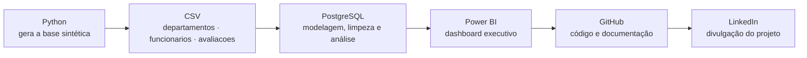
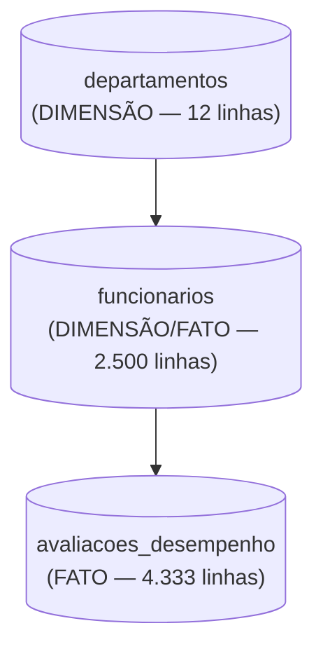

# Turnover e Desempenho — Documentação do Projeto

Projeto de portfólio de Vitor França, engenheiro civil em transição para análise de dados.

Repositório: `projeto-rh-turnover` (GitHub) · Dashboard: Power BI

---

## Requisitos e Configurações do Projeto

### 1. Pré-requisitos de Software (Ambiente Local)

* PostgreSQL 14+ (instalação local, com `psql` e pgAdmin 4)
* Power BI Desktop
* Python 3.x, para gerar a base sintética
* Conta no GitHub
* Dataset: CSVs sintéticos gerados em Python (`departamentos.csv`, `funcionarios.csv`, `avaliacoes_desempenho.csv`)

### 2. Fundamentos das Tecnologias

PostgreSQL – Conceitos Fundamentais (schema, DDL, constraints, window functions, CTE)
Power BI – Conceitos Fundamentais (modelo semântico, medidas DAX, colunas calculadas)
GitHub – Conceitos Fundamentais (repositório, README, commits)
Modelagem Relacional – Fundamentos (tabela dimensão x tabela fato)

### Dataset - Informações

Base sintética gerada em Python, calibrada com padrões públicos de mercado de RH (turnover geral de mercado costuma ficar entre 10% e 20% ao ano, com áreas comerciais e de atendimento historicamente na ponta mais alta e áreas técnicas na ponta mais baixa) — turnover mais alto em Comercial, Customer Success e Suporte Técnico, mais baixo em Jurídico e Dados & Analytics, maior risco de saída no primeiro ano de casa e queda de nota/engajamento associada a desligamento involuntário.

---

### 3. Principais Conceitos de Dados Utilizados

**Schema**
Namespace dentro do banco de dados que agrupa as tabelas do projeto (`rh`), separado do schema `public` padrão.
________________

**Turnover**
Percentual de funcionários que saíram da empresa (voluntária ou involuntariamente) sobre o total do quadro num período — o principal indicador de rotatividade de RH.
________________

**Desligamento voluntário x involuntário**
Voluntário é quando o funcionário pede pra sair (nova oportunidade, insatisfação, motivos pessoais). Involuntário é quando a empresa decide o desligamento (baixo desempenho, reestruturação, redução de quadro).
________________

**Window function `RANK`**
Função que atribui uma posição de ranking dentro de uma janela ordenada — usada aqui para ranquear os departamentos por taxa de turnover.
________________

**CTE (Common Table Expression)**
Tabela temporária criada dentro de uma query usando `WITH`, usada para organizar o cálculo de turnover por departamento antes de aplicar o `RANK`.
________________

**`PERCENTILE_CONT`**
Função estatística que calcula um percentil contínuo de uma distribuição — usada aqui para ver a faixa salarial (P25, mediana, P75) de cada nível de senioridade.
________________

**`FILTER (WHERE ...)`**
Cláusula que aplica uma condição dentro de uma função de agregação, sem precisar de subquery — usada em quase todo bloco de análise (ex: contar só os desligados dentro de um `COUNT`).
________________

**Ciclo de avaliação**
Período semestral (2024-S1, 2024-S2) em que cada funcionário ativo recebe uma nota de desempenho e um score de engajamento.
________________

**Medida DAX**
No Power BI, cálculo definido em DAX que agrega dados sob demanda, como `Turnover % = DIVIDE([Desligados], [Headcount Total])`.
________________

**Modelo semântico**
Camada do Power BI onde ficam as tabelas, relacionamentos e medidas — a base sobre a qual os gráficos do dashboard são construídos.

---

## ◾ Fluxo das Ferramentas (Arquitetura do Projeto)



Papel de cada etapa no pipeline: Python entrega os dados brutos em CSV; PostgreSQL é onde o dado é modelado, limpo e analisado (é daqui que saem os números oficiais do projeto); Power BI transforma o resultado das análises num dashboard visual; GitHub documenta e publica o código e os resultados; LinkedIn divulga o projeto pronto.


---

## ◾ PostgreSQL - Conceitos

O PostgreSQL é o banco de dados relacional usado para modelar, limpar e analisar os dados do projeto.

Papel no pipeline: camada de modelagem e análise — é onde os CSVs viram tabelas estruturadas e onde saem todos os números usados no README e no dashboard.

Estrutura básica



Como foi usado no projeto: schema próprio (`rh`, não `public`), com chaves primárias, foreign keys e índices garantindo a integridade. Depois da carga, roda-se limpeza (checagem de datas, coluna derivada `tempo_casa_anos`) e os blocos de análise com CTE, `RANK`, `FILTER` e `PERCENTILE_CONT`.

Comandos principais

| Comando | O que faz |
|---|---|
| `psql -f 02_sql/01_criar_tabelas.sql` | Cria o schema, as tabelas, constraints e índices |
| `\copy tabela FROM 'arquivo.csv' WITH (FORMAT csv, HEADER true, DELIMITER ';')` | Carrega os dados do CSV na tabela |
| `SET search_path TO rh;` | Aponta a sessão pro schema do projeto |
| `psql -f 02_sql/04_analises.sql` | Roda os blocos de análise (turnover por departamento, desempenho x motivo de saída, salário por senioridade) |

---

## ◾ Python - Conceitos

Usado só na etapa de geração da base sintética: cria os três CSVs (`departamentos`, `funcionarios`, `avaliacoes_desempenho`) calibrados com padrões públicos de mercado de RH, simulando o quadro de uma empresa fictícia sem usar dado real de nenhuma pessoa ou empresa.

---

## ◾ Power BI - Conceitos

O Power BI é a ferramenta de BI usada para montar o dashboard final do projeto.

Papel no pipeline: recebe o modelo direto dos CSVs de `03_dados/` e transforma os resultados das análises em visuais interativos.

Como foi usado no projeto: modelo semântico com relacionamentos `departamentos → funcionarios` e `funcionarios → avaliacoes_desempenho` (1 para muitos), coluna calculada de tempo de casa espelhando a limpeza feita em SQL, e medidas DAX — `Headcount Total`, `Ativos`, `Desligados`, `Turnover %`, `% Desligamento Involuntário`, `Tempo Médio de Casa`, `Salário Médio`, `Nota Média`, `Engajamento Médio` entre outras.

Visuais usados, pelo nome exato no painel Visualizações do Power BI Desktop: **Cartão** (KPIs de topo), **Gráfico de Barras Agrupadas** (ranking de turnover por departamento), **Gráfico de Colunas Agrupadas** (desempenho x motivo de saída, turnover por tempo de casa, engajamento por modelo de trabalho) e **Gráfico de Colunas Clusterizadas** (distribuição salarial P25/mediana/P75 por senioridade).

---

## ◾ GitHub - Conceitos

Repositório público usado para publicar o código, os dados e a documentação do projeto.

Estrutura padrão de pastas

```
02_sql/
  01_criar_tabelas.sql       — DDL: schema, PKs, FKs, constraints, índices
  02_carga_dados.sql         — \COPY dos CSV
  03_limpeza.sql             — checagens de qualidade, coluna derivada tempo_casa_anos
  04_analises.sql            — blocos de análise (turnover, desempenho, salário)

03_dados/
  departamentos.csv, funcionarios.csv, avaliacoes_desempenho.csv

04_prints/
  fluxograma_ferramentas.png, prints reais da execução no PostgreSQL, print do dashboard final

documentos/
  DOCUMENTACAO_PROJETO.md, GUIA_POWER_BI.md, 05_post_linkedin.md

README.md
00_gerar_base.py
```

---

## 🎲 Dataset - Informações

### TABELA: departamentos (dimensão)

Descrição: os 12 departamentos da empresa, agrupados em 4 diretorias.

Colunas
* `departamento_id` — identificador único
* `nome_departamento` — nome do departamento
* `diretoria` — Produto & Tecnologia, Receita, Operações ou Administrativo

### TABELA: funcionarios (dimensão com atributos de fato)

Descrição: todo funcionário que passou pela empresa entre 2018 e 2024 — ativo ou desligado.

Colunas
* `funcionario_id` — identificador único
* `nome_completo`, `genero`, `idade`, `cidade`, `uf` — dados cadastrais
* `departamento_id` — referência ao departamento
* `cargo`, `senioridade` — Estagiário, Júnior, Pleno, Sênior, Especialista, Coordenador ou Gerente
* `modelo_trabalho` — Presencial, Híbrido ou Remoto
* `data_admissao` — data de entrada
* `salario_atual` — salário na data de referência
* `status` — Ativo ou Desligado
* `data_desligamento`, `tipo_desligamento`, `motivo_desligamento` — preenchidos só quando desligado (`tipo_desligamento`: Voluntário, Involuntário ou Aposentadoria)
* `tempo_casa_anos` — coluna derivada na limpeza (tempo entre admissão e desligamento, ou até 31/12/2024 se ainda ativo)

### TABELA: avaliacoes_desempenho (fato)

Descrição: uma linha por funcionário por ciclo semestral em que ele estava ativo (2024-S1 e 2024-S2).

Colunas
* `avaliacao_id` — identificador único
* `funcionario_id` — referência ao funcionário avaliado
* `ciclo` — 2024-S1 ou 2024-S2
* `data_avaliacao` — data de referência do ciclo
* `nota_desempenho` — nota de 1.0 a 5.0
* `engajamento_score` — score de 0 a 100
* `recomendado_promocao` — se o gestor recomendou promoção nesse ciclo

### Relação entre as tabelas

`departamento_id` conecta `departamentos` a `funcionarios`. `funcionario_id` conecta `funcionarios` a `avaliacoes_desempenho`. `avaliacoes_desempenho` é a tabela fato usada para medir nota média, engajamento e recomendação de promoção.

### Números confirmados

* Headcount 2024: 2.500 funcionários · 2.164 ativos · 336 desligados
* Turnover geral: 13,4% · Tempo médio de casa: 3,4 anos · Salário médio: R$ 8.535,32
* Desligamentos por tipo: Voluntário 70,8% (238) · Involuntário 24,4% (82) · Aposentadoria 4,8% (16)
* Turnover por departamento, do maior pro menor: Comercial 21,6% · Customer Success 20,8% · Suporte Técnico 19,1% · Marketing 16,0% · Administrativo 12,8% · Financeiro 12,2% · Operações 12,0% · Engenharia de Software 11,6% · Recursos Humanos 11,2% · Produto 8,7% · Dados & Analytics 7,7% · Jurídico 7,6%
* Desempenho por motivo de saída: desligado involuntário — nota média 2,70, engajamento médio 43,0 (50 avaliações); desligado voluntário — nota média 3,69, engajamento médio 71,4 (142 avaliações); ativo — nota média 3,69, engajamento médio 71,2 (4.133 avaliações)
* Salário mediano por senioridade: Gerente R$ 22.603,46 · Especialista R$ 15.807,22 · Coordenador R$ 15.138,59 · Sênior R$ 12.290,26 · Pleno R$ 7.774,38 · Júnior R$ 4.482,84 · Estagiário R$ 2.185,82
* Turnover por tempo de casa: 22,5% no primeiro ano, caindo pra 14,8% (1-2 anos), 12,2% (2-4 anos) e 11,0% (acima de 4 anos)
* Engajamento por modelo de trabalho (2024-S2): Presencial 72,1 · Remoto 71,1 · Híbrido 71,0 — sem diferença relevante entre os três

Esses números vieram de execução real de SQL contra a base.

---

## Checklist de Execução

1. Definir o domínio do projeto (people analytics / turnover) e o escopo de dados
2. Gerar a base sintética em Python, calibrada com padrões de mercado reais de turnover
3. Escrever o DDL com schema próprio + constraints
4. Carregar e validar os dados (contagens batendo com o esperado)
5. Rodar limpeza e as análises reais em SQL — anotar os números exatos
6. Montar o dashboard em Power BI (extração via CSV, modelo, medidas, gráficos)
7. Criar o repositório no GitHub seguindo a estrutura de pastas padrão
8. Escrever o README seguindo o padrão de seções
9. Tirar os prints reais da execução (nunca fabricar print ou número)
10. Escrever o post do LinkedIn com os mesmos números do README
11. Revisar tudo contra a base real antes de publicar

---

## Armadilhas já mapeadas (para não repetir em projetos futuros)

* CSVs usam `;` como delimitador — sempre `DELIMITER ';'` no `\copy`.
* Tabelas ficam no schema `rh`, não em `public` — sempre `SET search_path` antes de qualquer query.
* Colunas nullable exportadas de pandas (idade, departamento_id) precisam do tipo `Int64` (nullable) antes de virar CSV, senão viram `float` e quebram o `COPY` num campo inteiro.
* Coluna booleana (`recomendado_promocao`) mapeada explicitamente para `t`/`f` antes de exportar, em vez de depender do `True`/`False` do pandas.
* Diferença de datas no Postgres (`data - data`) já retorna um inteiro em dias — usar `EXTRACT(EPOCH FROM ...)` em cima disso quebra com erro de função inexistente; a conta de tempo de casa é só `(data_fim - data_inicio) / 365.25`.
* Cruzar nota de desempenho com desligamento usando só `LAG` entre dois ciclos gera amostra pequena (poucos desligados têm as duas avaliações no mesmo ano) — a visão mais robusta é agregar todas as avaliações do ano por grupo (`GROUP BY` com `CASE`), que dá uma amostra bem maior e a mesma direção de resultado.
* Servidor PostgreSQL rodando em ambiente sandbox/isolado morre entre execuções separadas de terminal — subir o servidor e rodar todos os scripts dentro da mesma sessão de comando.
* Conferir sempre se os números do texto batem com os números reais da execução antes de publicar.
